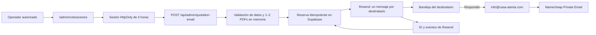

# Sistema de correo de cotizaciones

Guía operativa del flujo privado que adjunta uno o dos documentos PDF en un
único mensaje por destinatario, envía mediante Resend y registra una auditoría
mínima en Supabase. Ningún paso de esta guía autoriza un envío a una cliente
real ni un cambio DNS.

## Arquitectura



Responsabilidades:

| Capa                    | Responsabilidad                                                                   |
| ----------------------- | --------------------------------------------------------------------------------- |
| Interfaz privada        | Captura datos, muestra destinatarios, 1–2 PDFs, asunto y confirmaciones           |
| API administrativa      | Autentica, verifica origen, limita tamaño y valida el multipart                   |
| Dominio de cotizaciones | Valida campos/PDF, genera tags, hashes e idempotencia                             |
| Plantilla               | Produce HTML y texto plano con la identidad visual existente                      |
| Resend                  | Envía desde `info@`, devuelve un ID y expone eventos/logs                         |
| Supabase                | Reserva y audita cada destinatario sin guardar el PDF ni el correo completo       |
| Namecheap Private Email | Recibe las respuestas dirigidas a `info@casa-atenta.com`                          |
| Cloudflare              | Mantiene DNS autoritativo y los registros de autenticación; no es el buzón actual |

Archivos principales:

- `src/app/admin/cotizaciones/`: consola y confirmación operativa;
- `src/app/api/admin/quotation-session/route.ts`: login y cierre de sesión;
- `src/app/api/admin/quotation-email/route.ts`: endpoint multipart protegido;
- `src/lib/quotation-email/`: validación, idempotencia y entrega desacopladas;
- `src/lib/server/quotation-email.ts`: adaptadores reales de Supabase y Resend;
- `src/lib/server/email.ts`: HTML y texto plano;
- `src/lib/server/env.ts`: invariantes de configuración server-side.

## Cuentas, MCP y runtime

Supabase y Resend pertenecen a la infraestructura separada de Casa Atenta. Son
cuentas distintas de los conectores globales/personales de Codex. GitHub y
Cloudflare sí continúan compartiendo las conexiones globales existentes. La
identidad privada usada durante OAuth nunca se documenta ni se confirma en Git.

`.codex/config.toml` mantiene el MCP dentro de este repositorio:

- deshabilita aquí la app global de Supabase;
- fija Supabase al proyecto verificado `casa-atenta-production`
  (`vywtnakijogqoiumnqaa`) y conserva `read_only=true`;
- usa OAuth, por lo que ningún token se confirma en Git;
- conecta el MCP remoto oficial de Resend con el team de Casa Atenta,
  `full_access` y aprobación `prompt` para cada herramienta.

La comprobación desde otro directorio confirmó que ninguna de estas entradas
locales aparece fuera del repositorio. Supabase solo expuso las tablas de Casa
Atenta y no ofreció escrituras por configuración; Resend expuso el dominio
verificado `casa-atenta.com`.

El MCP es una capacidad de desarrollo/operación. La aplicación no usa sus
tokens. El runtime consume secretos separados cargados en Vercel:

| Variable                         | Uso                                                                                                                |
| -------------------------------- | ------------------------------------------------------------------------------------------------------------------ |
| `SUPABASE_URL`                   | URL server-side del proyecto de Casa Atenta                                                                        |
| `SUPABASE_SECRET_KEY`            | Escritura de auditoría exclusivamente desde servidor                                                               |
| `RESEND_API_KEY`                 | Envío transaccional desde el runtime                                                                               |
| `RESEND_FROM_EMAIL`              | Remitente general existente de la web principal (`notificaciones@`)                                                |
| `QUOTATION_RESEND_FROM_EMAIL`    | Opcional; si existe debe ser exactamente `Casa Atenta <info@casa-atenta.com>`; el código usa ese valor por defecto |
| `QUOTATION_AUDIT_SECRET`         | HMAC independiente para minimizar el destinatario en auditoría, mínimo 32 caracteres                               |
| `QUOTATION_TEST_RECIPIENTS`      | Allowlist privada, normalizada y separada por comas para `isTest=true`                                             |
| `QUOTATION_ALERT_RECIPIENTS`     | Buzones operativos para alertas de rebote, queja y supresión; independiente de las pruebas                         |
| `QUOTATION_PRODUCTION_ENABLED`   | Gate server-side; debe permanecer `false` hasta autorizar envíos reales                                            |
| `QUOTATION_ADMIN_ACCESS_TOKEN`   | Credencial humana de entrada, mínimo 32 caracteres                                                                 |
| `QUOTATION_ADMIN_SESSION_SECRET` | Firma de sesión, mínimo 32 caracteres y distinta del token                                                         |

`RESEND_WEBHOOK_SECRET`, `RATE_LIMIT_SECRET` y las demás variables comunes
mantienen sus funciones existentes. Nunca se deben reutilizar como token
administrativo.

## Autenticación administrativa

La ruta `/admin/cotizaciones` no es pública ni indexable. La ausencia de
indexación no es el control de seguridad; lo son estas capas:

1. El token de acceso se compara en tiempo constante.
2. El login admite cinco intentos por huella en 15 minutos.
3. La sesión firmada dura cuatro horas y usa cookie `HttpOnly`, `SameSite=Strict`
   y `Secure` en producción; el nombre de producción usa prefijo `__Host-`.
4. El endpoint de envío exige sesión válida, `Origin` idéntico,
   `Sec-Fetch-Site` compatible y el marcador interno esperado.
5. Las respuestas administrativas usan `Cache-Control: no-store`, política de
   referrer restrictiva y bloqueo de framing.

Rotar `QUOTATION_ADMIN_SESSION_SECRET` invalida todas las sesiones existentes.
No compartir el token por chat, correo ni capturas.

## PDFs transitorios y límite conjunto de 4 MiB

Cada solicitud contiene uno o dos archivos bajo el mismo campo `pdf` de
`multipart/form-data`. Se procesan en memoria y nunca se escriben en `public/`,
disco persistente, Supabase Storage ni Git. El límite agregado de todos los PDFs
es exactamente `4 * 1024 * 1024` bytes (4 MiB); la solicitud completa admite
esos documentos más 256 KiB de envoltura y los metadatos no pueden superar
16 KiB.

El servidor comprueba:

- entre uno y dos archivos, ambos no vacíos y con tamaño declarado igual a sus
  bytes recibidos;
- nombre de archivo sin rutas ni caracteres de control, extensión `.pdf`;
- MIME `application/pdf` y firma binaria inicial `%PDF-` en cada archivo;
- límite agregado de 4 MiB;
- SHA-256 de la composición ordenada de archivos para idempotencia;
- con un documento, nombre profesional
  `Casa-Atenta-Cotizacion-<numero>.pdf`; con dos, se conservan los dos nombres
  originales validados en el mensaje y se registra una referencia agregada en
  auditoría.

Los adjuntos se entregan juntos a Resend como bytes dentro de un único mensaje.
No se publica una URL y la auditoría solo conserva una referencia profesional y
el tamaño total.

## Remitente, respuestas y DNS

Toda cotización usa de forma invariable:

```text
From: Casa Atenta <info@casa-atenta.com>
Reply-To: info@casa-atenta.com
```

Resend realiza la salida. Cuando la destinataria responde, los MX de
`casa-atenta.com` llevan el mensaje al buzón actual de Namecheap Private Email.
Cloudflare administra la zona DNS compartida, pero no recibe este buzón.

- MX controla recepción.
- SPF autoriza infraestructura de salida para un hostname.
- DKIM firma y autentica el mensaje.
- DMARC comprueba alineación y aplica/reporta una política.

Usar Resend no requiere mover MX. Esta implementación no cambia DNS, no activa
Cloudflare Email Routing y no cancela Namecheap Private Email.

## Modo de prueba

El modo inicial es siempre prueba. Sus protecciones se validan tanto en la
interfaz como en el servidor:

- `isTest` debe ser `true`;
- solo se admiten las direcciones cargadas en la variable privada
  `QUOTATION_TEST_RECIPIENTS`;
- cualquier otra dirección invalida toda la solicitud;
- se genera un mensaje separado por cada dirección autorizada, sin CC/BCC, para
  obtener un ID individual;
- asunto, contenido, adjuntos y estética son los mismos que vería la cliente;
- el modo de prueba sigue identificado de forma no visible mediante auditoría,
  tags de Resend e idempotencia;
- la interfaz exige confirmar que la operación no puede dirigirse a la
  cliente.

Procedimiento:

1. Abrir el despliegue Preview y autenticarse en `/admin/cotizaciones`.
2. Mantener **Prueba interna**.
3. Revisar tratamiento, nombre, número, proyecto, ubicación, importe y todos los
   destinatarios visibles.
4. Adjuntar uno o dos PDFs reales y comprobar nombres, MIME y tamaño conjunto
   menor o igual a 4 MiB.
5. Revisar asunto, preheader, `From` y `Reply-To`.
6. Marcar la confirmación operativa una sola vez y enviar.
7. Guardar el resumen técnico con un ID de Resend y una clave de idempotencia
   por destinatario.
8. Verificar logs/eventos e inbox de cada destinatario. `sent` significa
   aceptado por Resend, no entregado definitivamente.
9. Confirmar expresamente que no hubo destinatarios adicionales.

Para una ejecución operativa desde un entorno seguro también existe este
comando de prueba. Usa la misma plantilla, validación, reserva y adaptadores
server-side que la consola:

```bash
npm run quotation:test:send -- \
  --pdf /ruta/a/cotizacion.pdf \
  --pdf /ruta/a/contrato.pdf \
  --treatment "Sra." \
  --client-name "Cliente de prueba" \
  --quotation-number "TEST-0001" \
  --project "Proyecto de prueba" \
  --location "Ubicación de prueba" \
  --total "1000.00" \
  --delivery-message "Tal como conversamos, adjuntamos la documentación revisada." \
  --closing-message "Reciba un cordial saludo de parte del equipo." \
  --confirm-internal-tests
```

Todos los argumentos del ejemplo son obligatorios salvo el segundo `--pdf`,
`--render-link`, `--subject`, `--delivery-message` y `--closing-message`, que son
opcionales. Sustituirlos por los datos ya revisados, sin copiarlos a esta guía
ni al historial del shell compartido. El comando no acepta destinatarios por argumento: usa exclusivamente
`QUOTATION_TEST_RECIPIENTS`, no admite producción ni destinatarios arbitrarios y
devuelve únicamente direcciones enmascaradas, nombres/tamaños, IDs e
idempotencia.

## Producción

Producción nunca es un fallback automático. Con
`QUOTATION_PRODUCTION_ENABLED` ausente o distinto de `true`, el servidor la
rechaza aunque la solicitud esté manipulada. Una vez habilitada expresamente,
requiere cambiar `isTest` a `false`, escribir destinatarios reales desde cero y
superar dos controles:

1. confirmar que se revisaron destinatario, alcance, partidas, total,
   fotografías y metadatos del PDF;
2. escribir exactamente `CONFIRMAR ENVIO <numero-de-cotizacion>`.

Además debe existir autorización humana explícita y
`QUOTATION_PRODUCTION_ENABLED=true` en el entorno server-side. Antes de habilitar
esa bandera se deben resolver todas las alertas documentales: suma de partidas
frente al total, alcance declarado, fotografías y metadatos internos del PDF.
Las pruebas internas no levantan ese bloqueo operativo.

Checklist de producción:

- PDF o PDFs finales corregidos, sin metadatos impropios y revisados
  visualmente;
- destinatarios escritos y leídos en voz alta por otra persona cuando sea
  posible;
- importe y número iguales en PDF, formulario, asunto y preheader;
- el render debe usar HTTPS bajo `casa-atenta.com`, `www.casa-atenta.com` o un
  enlace directo de archivo/carpeta en `drive.google.com`;
- `From` y `Reply-To` exactos;
- Resend y Supabase operativos;
- ninguna operación idéntica ya reservada;
- ninguna entrega anterior al mismo destinatario con estado `bounced`,
  `complained` o `suppressed`;
- autorización explícita registrada fuera del contenido del correo.

## Idempotencia y auditoría

Cada destinatario se procesa por separado. La clave estable deriva de:

- versión de plantilla;
- número de cotización;
- destinatario normalizado;
- modo prueba/producción;
- SHA-256 del PDF o de la composición ordenada de los dos PDFs;
- SHA-256 del asunto, HTML y texto plano.

Primero se reserva la clave única en `quotation_email_deliveries`; después se
usa la misma clave ante Resend. Recargar la página o repetir el mismo contenido
no produce otro envío.

La auditoría conserva fecha, número, modo, destinatario enmascarado, huella
HMAC del destinatario, nombre/tamaño del adjunto, estado, ID de Resend, error
sanitizado, intentos y clave de idempotencia. No conserva:

- dirección completa en texto claro;
- PDF, Base64 ni bytes;
- HTML o texto del correo;
- API keys, cookies o tokens;
- detalles sensibles del proyecto.

El ciclo diario de retención elimina estas auditorías técnicas al cumplir 365
días. No se debe desactivar esa limpieza ni usar esta tabla como archivo legal
de cotizaciones.

Los webhooks de rebote, queja, supresión, demora, fallo o cancelación crean
primero una alerta pendiente en `email_events`. El envío interno usa una clave
estable por `svix_id`; solo se marca `sent` después de persistir el ID de
Resend. El tipo y detalle sanitizado del incidente quedan inmutables en el
outbox. Cada intento se reclama con compare-and-swap y lease para que webhook y
cron no lo ejecuten a la vez; el contador avanza al cerrar el intento, de modo
que incluso un claim vencido durante el quinto intento puede recuperarse sin
abrir un sexto intento ordinario. Un fallo devuelve `503` para provocar el
reintento firmado y el cron diario recupera hasta cinco intentos pendientes o
claims vencidos. Así, una caída transitoria no convierte el incidente en una
alerta perdida silenciosamente.

Estados de la operación:

| Estado                   | Significado                                       | Acción                                                |
| ------------------------ | ------------------------------------------------- | ----------------------------------------------------- |
| `sent`                   | Resend aceptó y Supabase quedó actualizado        | Consultar evento de entrega; no reenviar              |
| `pending`                | Existe reserva, pero no hay cierre verificable    | Bloquear reenvío y reconciliar manualmente con Resend |
| `duplicate`              | Ya existe la misma reserva                        | Revisar estado/ID anterior; no eliminar la reserva    |
| `blocked`                | El destinatario tiene rebote, queja o supresión   | No enviar; revisar y desbloquear de forma auditada    |
| `failed`                 | Resend o la preparación falló de forma sanitizada | Investigar antes de cualquier nueva operación         |
| `accepted_audit_pending` | Resend aceptó, pero falló el cierre de auditoría  | No reenviar; reconciliar usando el ID de Resend       |

## Errores y respuesta segura

| HTTP/resultado | Causa típica                                                    |
| -------------- | --------------------------------------------------------------- |
| `400`          | Campos, JSON, PDF o confirmación inválidos                      |
| `401`          | Sesión ausente o vencida                                        |
| `403`          | Origen o marcador administrativo inválido                       |
| `409`          | Duplicado, supresión previa o estado que exige revisión         |
| `413`          | PDF o solicitud por encima del límite                           |
| `415`          | Content-Type distinto de multipart                              |
| `207`          | Algunos destinatarios fallaron y otros tuvieron resultado       |
| `502`          | Fallaron todos los envíos al proveedor                          |
| `500`          | Fallo interno no clasificable; no reintentar sin revisar estado |

Resend tiene un timeout de 15 segundos y se exige un ID no vacío. Los errores
se recortan y eliminan correos, secretos, Bearer tokens, rutas locales y cadenas
largas. Un timeout es un estado incierto: comprobar primero logs de Resend y la
auditoría antes de considerar otro intento.

## Despliegue y verificación

1. Aplicar las migraciones que crean `quotation_email_deliveries` y el outbox
   de alertas en `email_events` en el proyecto Supabase correcto; verificar
   RLS/permisos exclusivamente server-side.
2. Cargar en Vercel todas las variables requeridas, incluidas
   `QUOTATION_AUDIT_SECRET` y la lista independiente
   `QUOTATION_ALERT_RECIPIENTS`, sin imprimir valores.
3. Conservar `RESEND_FROM_EMAIL` para los mensajes generales y, si se define
   `QUOTATION_RESEND_FROM_EMAIL`, confirmar que coincida exactamente con
   `Casa Atenta <info@casa-atenta.com>`; cualquier otra variante bloquea el
   módulo de cotizaciones.
4. Crear un despliegue Preview y ejecutar formatter, lint, typecheck, pruebas y
   build.
5. Validar login, expiración/cierre de sesión, límite de archivo, allowlist y
   duplicado con mocks antes de tocar Resend real.
6. Ejecutar únicamente los envíos de prueba previstos para la allowlist
   autorizada.
7. En Resend, comprobar por ID `accepted`, `delivered`, `bounced`,
   `complained`, `failed` o pendiente.
8. En Supabase, confirmar una auditoría separada por destinatario sin PII
   innecesaria.
9. Revisar en Gmail encabezados `Authentication-Results` para SPF, DKIM y
   DMARC, imágenes bloqueadas, móvil y modo oscuro.
10. Responder a la prueba y comprobar llegada al buzón de Namecheap.
11. No promover a producción mientras exista una inconsistencia documental o
    un estado de entrega/auditoría sin reconciliar.

## Rollback

El rollback del sistema de cotizaciones es de aplicación, no de DNS:

1. detener nuevos envíos y conservar logs/filas de auditoría;
2. rotar `QUOTATION_ADMIN_SESSION_SECRET` para invalidar sesiones si existe un
   incidente de acceso;
3. retirar temporalmente las variables `QUOTATION_ADMIN_*` o desplegar la
   versión anterior para dejar la consola indisponible;
4. revocar/rotar `RESEND_API_KEY` solo ante compromiso, porque puede afectar
   otros correos transaccionales;
5. reconciliar IDs aceptados antes de restaurar servicio;
6. no borrar auditoría, no modificar MX y no activar Email Routing como medida
   de rollback.

## Corrección y reenvío

No se debe “forzar” un reenvío borrando la fila de auditoría o inventando una
clave. El procedimiento depende del caso:

- **Corrección de los PDFs o del contenido:** generar y revisar documentos
  nuevos.
  El nuevo digest produce una operación distinta; conservar la auditoría
  original y repetir primero el modo de prueba.
- **Estado `sent` o `accepted_audit_pending`:** no reenviar. Confirmar el ID en
  Resend y reconciliar la auditoría.
- **Timeout o estado incierto:** comprobar Resend antes de actuar; el proveedor
  pudo aceptar el mensaje aunque la respuesta local fallara.
- **Reenvío idéntico solicitado conscientemente:** el sistema actual lo bloquea
  por diseño. Requiere una función futura explícita de reenvío que referencie la
  entrega original y genere un nuevo intento auditable. Hasta entonces se
  escala a ingeniería; no se altera manualmente la clave.

Toda corrección destinada a una cliente real vuelve a pasar por autorización
de producción, revisión de destinatario y confirmación literal.

## Prohibiciones permanentes

- No enviar a una cliente real durante la fase de prueba.
- No colocar los PDFs en `public/`, GitHub o una URL temporal.
- No copiar secretos del dashboard al chat, logs, documentos o commits.
- No usar CC/BCC para simular trazabilidad individual.
- No afirmar “entregado” basándose solo en la aceptación de la API.
- No cambiar MX, SPF, DKIM o DMARC sin diagnóstico, propuesta y autorización
  explícita; esta implementación no requiere un cambio DNS.
